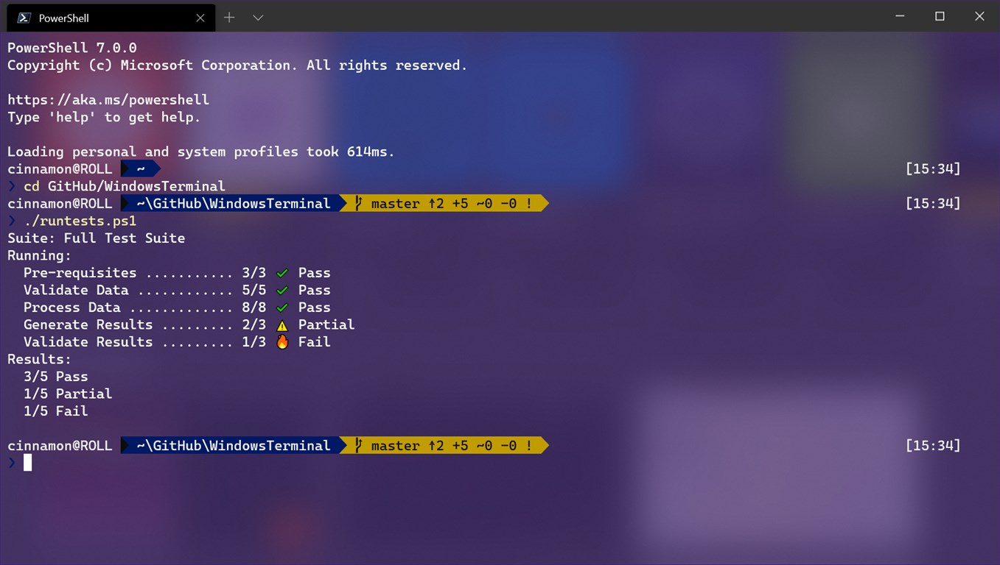
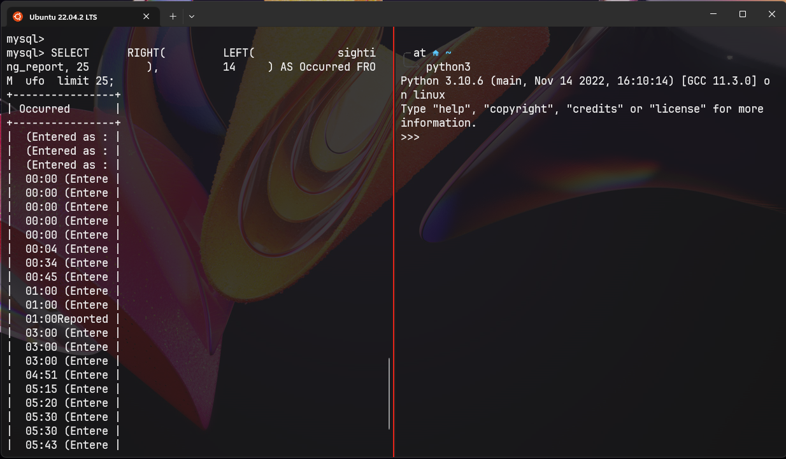
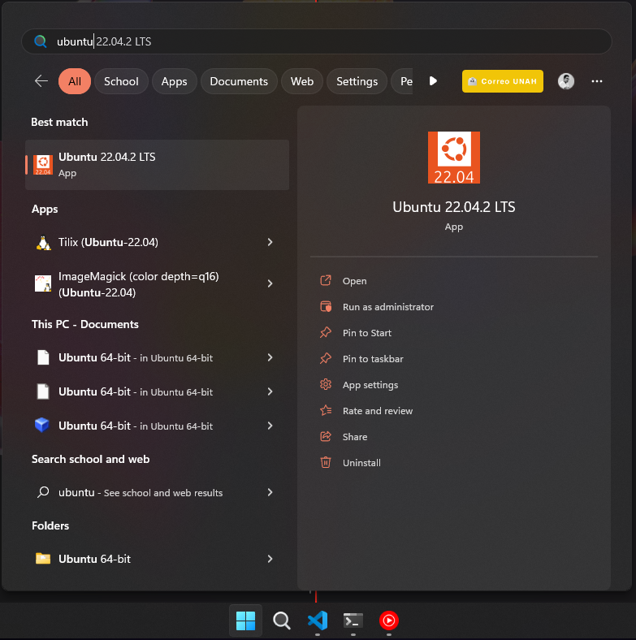

<!-- TOC start (generated with https://github.com/derlin/bitdowntoc) -->
**Tabla de contenido**
- [IIDDBD - Sesión 1 | Construyendo la infraestructura](#iiddbd---sesión-1--construyendo-la-infraestructura)
  - [Configuración de WSL](#configuración-de-wsl)
    - [Terminal de Windows](#terminal-de-windows)
    - [Ubuntu 22.04 LTS](#ubuntu-2204-lts)
    - [Shell de linux y algunos comandos](#shell-de-linux-y-algunos-comandos)
  - [Configuración de Python](#configuración-de-python)
    - [Entornos virtuales utilizando venv](#entornos-virtuales-utilizando-venv)
    - [Manejador de paquetes PIP](#manejador-de-paquetes-pip)
    - [Configurando nuestro entorno](#configurando-nuestro-entorno)
  - [Instalación y configuración de MySQL](#instalación-y-configuración-de-mysql)
  - [Instalación de MySQL Workbench](#instalación-de-mysql-workbench)
  - [Instalación de Draw.io (Microsoft store)](#instalación-de-drawio-microsoft-store)
  - [Instalación de Talend](#instalación-de-talend)
  - [Git](#git)

<!-- TOC end -->

# IIDDBD - Sesión 1 | Construyendo la infraestructura
<br>

## Configuración de WSL
- Windows Features
  - Habilitar `Virtual Machine platform`
  - Habilitar `Windows Subsystem for linux`

### Terminal de Windows 

[Windows Terminal](https://apps.microsoft.com/store/detail/windows-terminal/9N0DX20HK701?hl=es-es&gl=es)




<br>

### Ubuntu 22.04 LTS

[Ubuntu 22.04.2 LTS](https://apps.microsoft.com/store/detail/ubuntu-22042-lts/9PN20MSR04DW?hl=es-es&gl=es)



<br>

### Shell de linux y algunos comandos 

- Navegación por directorios `ls, cd, pwd`
- Manipulación de archivos y directorios `mkdir, touch, cat, less, batcat, nano`
- Redirección y tuberías `>>, >, | grep`
- Permisos de archivos `ls -l`

<br>

## Configuración de Python
<br>

### Entornos virtuales utilizando venv
<br>

**Crear un entorno virtual de python**
```python3
python3 -m venv nombre_entorno
```
  
**Activar entorno virtual**
```pyhon3
source nombre_entorno/bin/activate
```
<br>

### Manejador de paquetes PIP
<br>

**Verificar la versión del manejador de paquetes**
```bash
pip -V
```
<br>

### Configurando nuestro entorno 
<br>

**Instalando Pandas**
```shell
pip install pandas
```
[Página oficial de pandas](https://pandas.pydata.org/)

**Instalando Numpy**
```shell
pip install numpy
```
[Página oficial de Numpy](https://numpy.org/install/)

**Instalando Jupyter notebook**
```shell
pip install notebook
```
[Página oficial de Colab](https://jupyter.org/install)

**Instalando el conector de mysql**
```shell
pip install mysql-connector-python
```
[Página oficial de MySQL](https://dev.mysql.com/doc/connector-python/en/connector-python-installation-binary.html)

<br>

## Instalación y configuración de MySQL
<br>

**Instalando MySQL en Ubuntu**

**Actualizar el repositorio interno**
```shell
sudo apt update
sudo apt upgrade
```


**Instalando MySQL**
```shell
sudo apt install mysql-server
```

**Conociendo el estado del servicio en UBUTU**
```shell
sudo service mysql status
```

**Primeros pasos, configuración**
```shell 
sudo mysql
mysql> ALTER USER 'root'@'localhost' IDENTIFIED WITH mysql_native_password BY 'password';
mysql> exit
```

[TCL](https://www.digitalocean.com/community/tutorials/how-to-install-mysql-on-ubuntu-20-04)

**Configurando el servidor**
```shell
sudo mysql_secure_installation
```

**Entrando al servidor de MySQL**
```shell
sudo mysql -u username -p password

#Cambiamos el modo de autenticación para el usuario root
sudo mysql -u root -p
mysql> ALTER USER 'root'@'localhost' IDENTIFIED WITH auth_socket;
```

<br>

## Instalación de MySQL Workbench

[Instalación de librería necesaria | C++](https://aka.ms/vs/17/release/vc_redist.x64.exe)
[Enlace](https://dev.mysql.com/downloads/workbench/)

<br>

## Instalación de Draw.io (Microsoft store)

[Enlace](https://apps.microsoft.com/store/detail/drawio-diagrams/9MVVSZK43QQW?hl=en-us&gl=us)

<br>

## Instalación de Talend

[Guía de instalación](https://drive.google.com/file/d/1kN6s-awdRI7yDZgalApfqe9BW24WwiS3/view?usp=sharing)

<br>

## Git

```shell
git --version

git config --global user.name "Tu nombre de usuario"
git config --global user.email "Tu correo electrónico"
```